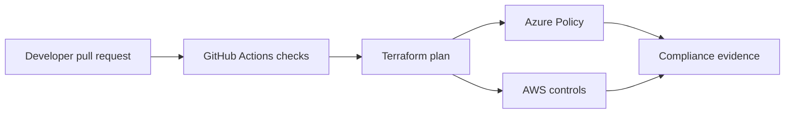

# Architecture

```mermaid
flowchart LR
    A[Developer pull request] --> B[GitHub Actions checks]
    B --> C[Terraform plan]
    C --> D[Azure Policy]
    C --> E[AWS controls]
    D --> F[Compliance evidence]
    E --> F
```

The pipeline checks infrastructure code before deployment. Cloud controls then prevent or find unsafe changes. The project stores proof of the result as compliance evidence.
